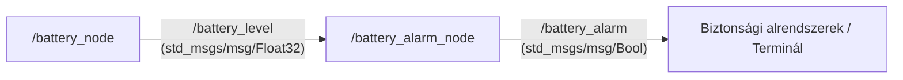

# rei_l0c_batterymonitor


ROS 2 Humble alapú, C++ nyelven megvalósított járműipari állapotfigyelő rendszer, amely egy elektromos hajtású jármű akkumulátorának merülését szimulálja, és kritikus feszültségszint esetén vészjelzést generál.

---

## Rendszerarchitektúra



---

## Topic architektúra és adatstruktúrák

| Topic neve | Irány | Üzenettípus | Szerep és tartalom |
| :--- | :--- | :--- | :--- |
| **/battery_level** | `/battery_node` → `/battery_alarm_node` | `std_msgs/msg/Float32` | A szimulált akkumulátor pillanatnyi töltöttségi foka (0.0% – 100.0%). |
| **/battery_alarm** | `/battery_alarm_node` → Külvilág / Rendszer | `std_msgs/msg/Bool` | Vészleállító vagy figyelmeztető állapot (`True`: riasztás aktív, `False`: normál működés). |

---

## Küszöbértékek és működés

| Paraméter | Normál tartomány | Riasztási küszöb | Rendszerállapot / Log |
| :--- | :--- | :--- | :--- |
| **Akkumulátorszint** | > 20.0 % | ≤ 20.0 % | Normál állapot: `INFO` log, `/battery_alarm`: `False` |
| **Akkumulátorszint** | — | ≤ 20.0 % | Kritikus állapot: `WARN` log, `/battery_alarm`: `True` |

- **/battery_node**: Virtuális telemetria-generátor (Publisher). 100.0%-os szintről indulva 1 Hz frekvenciával lépésenként 5.0%-kal csökkenti a töltöttséget. 0.0% elérésekor automatikusan 100.0%-ra ugrik vissza az újratöltési ciklus szimulálásához.
- **/battery_alarm_node**: Állapotfigyelő egység (Subscriber és Publisher). Vizsgálja a beérkező adatokat: 20.0% felett `False`, 20.0% alatt azonnali `True` logikai riasztást publikál a `/battery_alarm` topicra kiemelt terminálfigyelmeztetés mellett.

---

## Build és Futtatás

```bash
Feltételezzük, hogy a munkaterület: `~/ros2_ws/`.

# Csomagok klónozása:
cd ~/ros2_ws/src
git clone https://github.com/reidernorbi/rei_l0c_batterymonitor

# Fordítás a workspace gyökeréből
cd ~/ros2_ws
colcon build --packages-select rei_l0c_batterymonitor --symlink-install

# Környezet betöltése és központi indítás
source ~/ros2_ws/install/setup.bash
ros2 launch rei_l0c_batterymonitor battery_system.launch.py
```

---

## Diagnosztika és tesztelés

A futó rendszer állapota külön terminálablakból ellenőrizhető a ROS 2 beépített eszközeivel:

```bash
# Elérhető topicok listázása
ros2 topic list

# Folyamatos akkumulátorszint-telemetria kiolvasása
ros2 topic echo /battery_level

# Riasztási állapot figyelése
ros2 topic echo /battery_alarm
```
